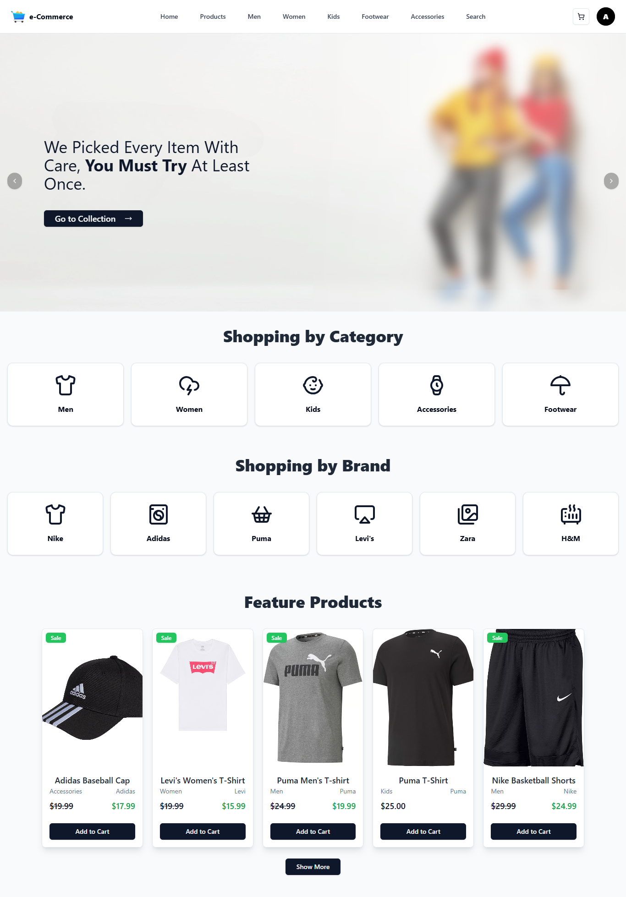
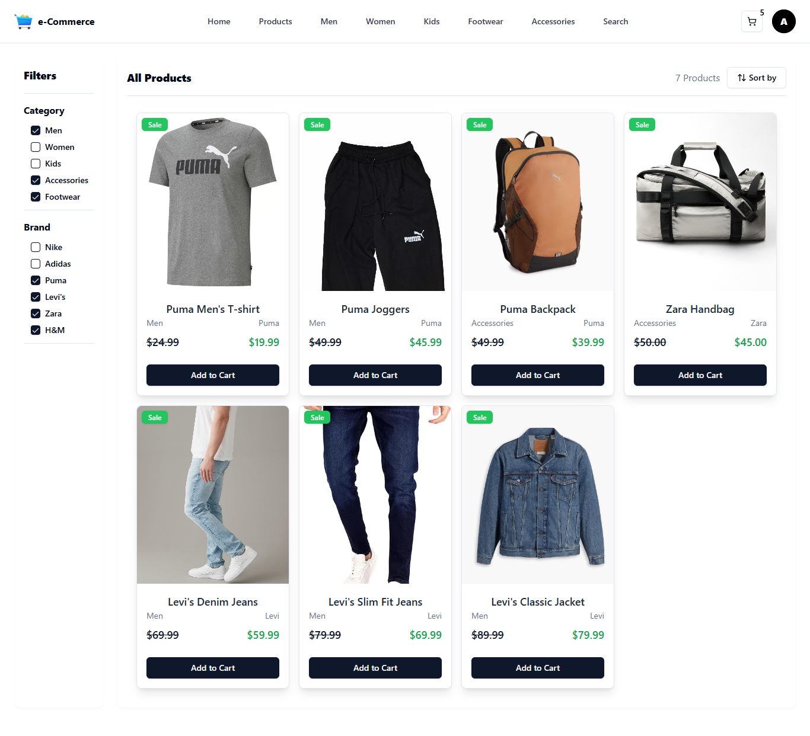
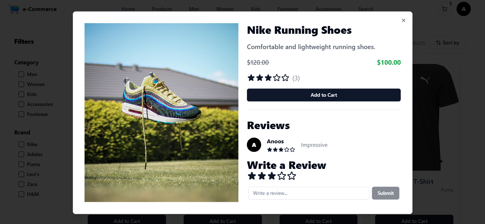
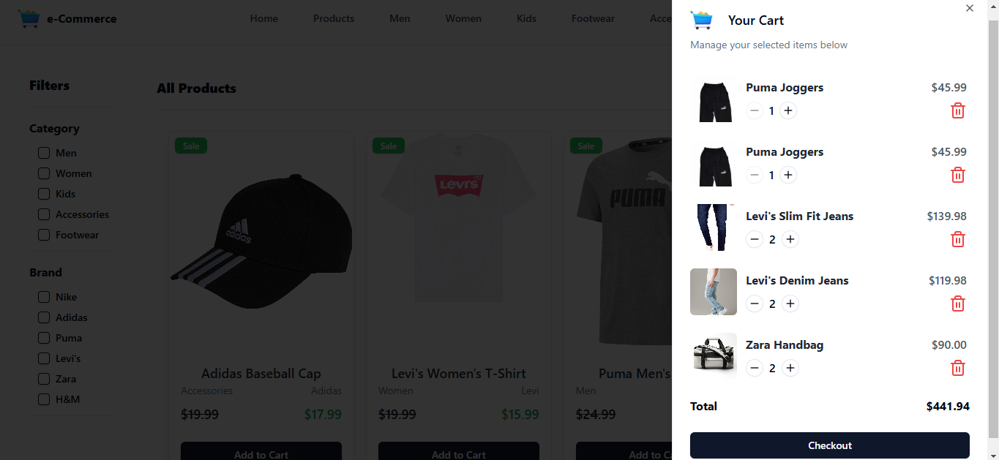
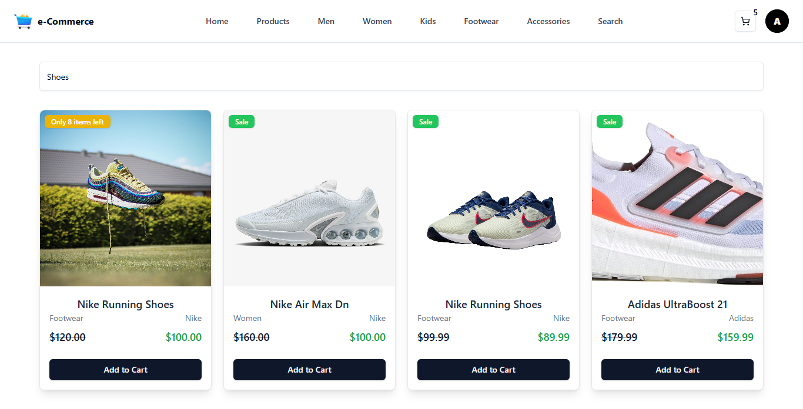
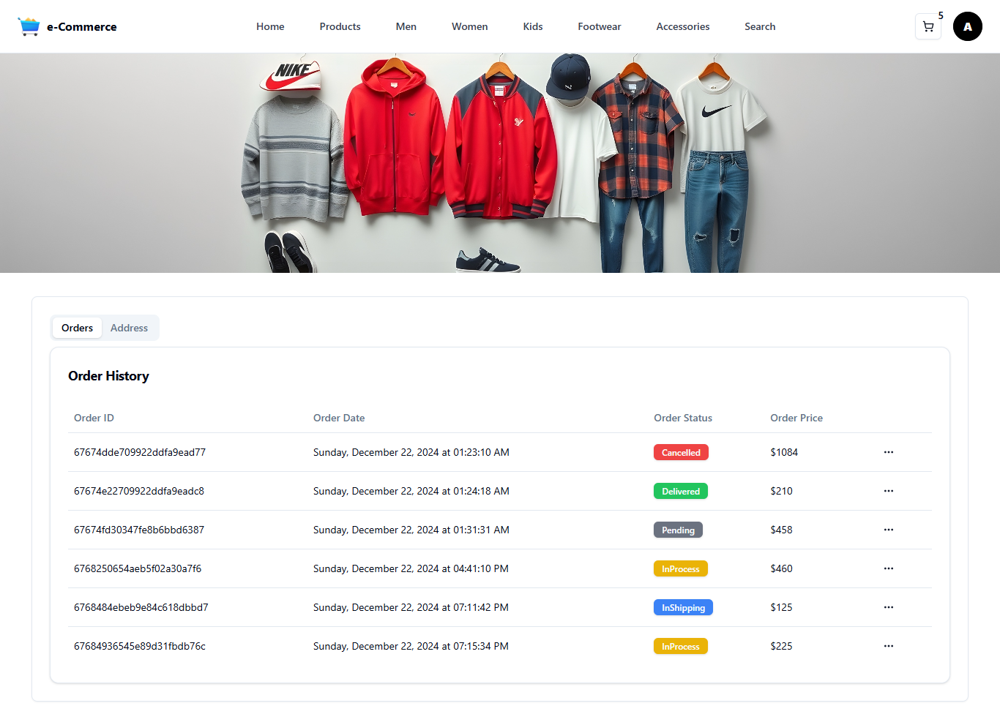
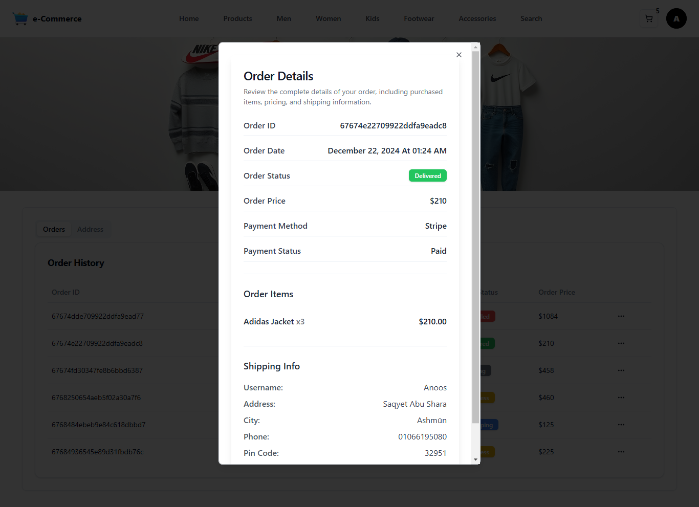

# 🛍️ MERN eCommerce App Frontend

Welcome to the frontend of the MERN eCommerce application! This project serves as the client-side interface of a full-stack eCommerce platform, built with React.js and Vite, providing users with a seamless shopping experience.

## 🚀 Features

- **User-Friendly Interface**: Intuitive design for easy navigation.
- **Product Browsing**: View and search for products effortlessly.
- **Shopping Cart**: Add, remove, and manage cart items.
- **Order Management**: Place orders and track order details.
- **Admin Panel**: Manage products, orders, and users with ease.

## 🛠️ Installation Guide

Follow these steps to set up the project locally:

1. **Clone the Repository**:

   ```bash
   git clone https://github.com/AnasHany2193/mern-eCommerce-app-frontend.git
   cd mern-eCommerce-app-frontend
   ```

2. **Install Dependencies**:

   Ensure you have [Node.js](https://nodejs.org/) installed. Then, run:

   ```bash
   npm install
   ```

3. **Environment Variables**:

   Create a `.env` file in the root directory and add the following variables:

   ```env
   VITE_API_URL=http://localhost:5000
   VITE_STRIPE_PUBLIC_KEY=your_stripe_public_key
   ```

   Replace the placeholder values with your actual configuration details.

4. **Start the Application**:

   ```bash
   npm run dev
   ```

   The application should now be running on `http://localhost:3000`.

## 📸 Screenshots

Here are some screenshots showcasing different parts of the application:

- **Home Page**:
  
  _The landing page displaying featured products and promotions._

- **Products Page**:
  
  _A catalog of all available products with filtering options._

- **Product Details Page**:
  
  _Detailed view of a selected product, including descriptions and reviews._

- **Shopping Cart**:
  
  _View of the shopping cart with selected items ready for checkout._

- **Search Results**:
  
  _Results page displaying products matching the search query._

- **Orders Page**:
  
  _List of user orders with statuses and summaries._

- **Order Details Page**:
  
  _Detailed view of a specific order, including itemized products and shipping information._

## 🛡️ Admin Panel

The application includes an admin panel that allows administrators to:

- **Manage Products**: Add, edit, or delete products.
- **Handle Orders**: View and update order statuses.
- **User Management**: Manage user roles and access.

This ensures efficient management of the eCommerce platform.

## 👤 About the Author

Developed by [Anas Hany](https://www.linkedin.com/in/anashany219/). Feel free to connect!

---

Happy shopping! 🎉
